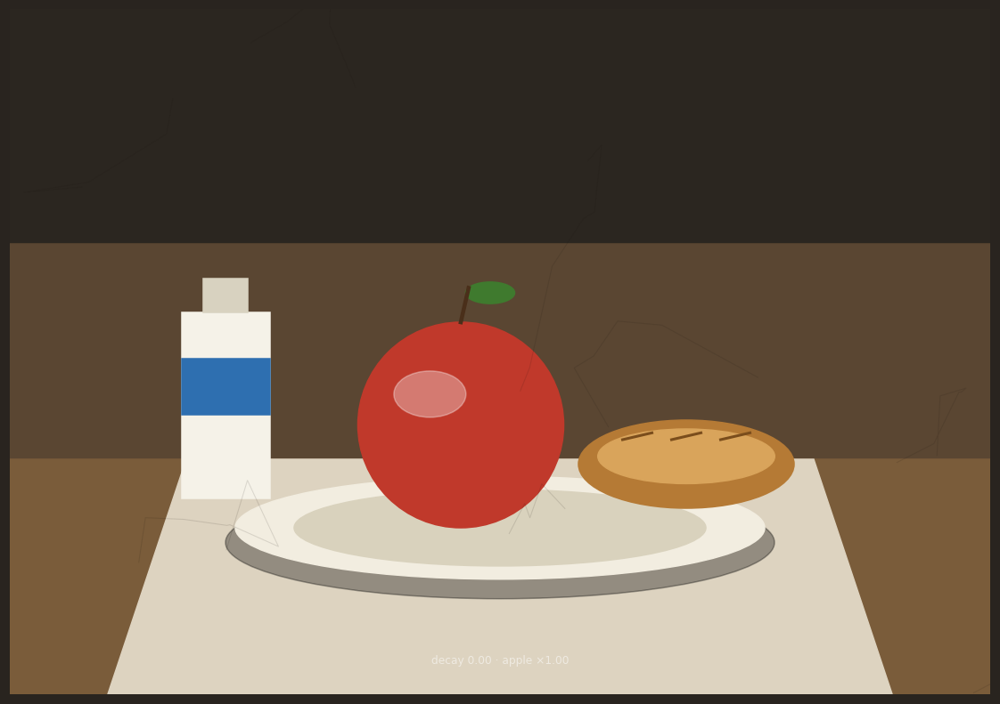
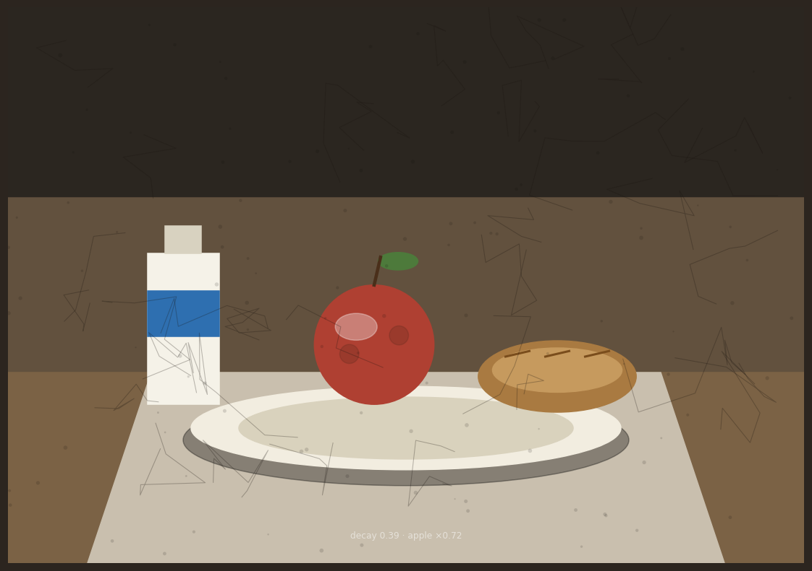
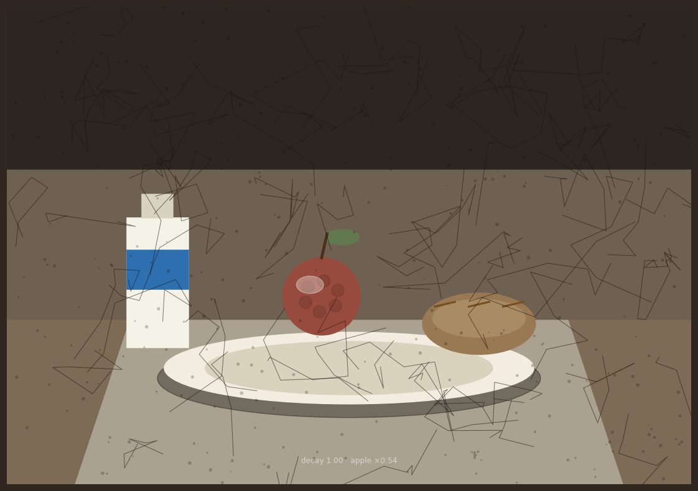

# 🍎 Inflation Easel

**Slider: 1970 → 2026. A classic still life gets re-drawn as groceries get expensive.**

An apple goes from **$0.25 to ~$1.73** and visibly *shrinks* in the painting.
The bread stales, the varnish cracks, the palette fades — all driven by real
U.S. Bureau of Labor Statistics CPI data.

| 1970 · pristine | 1995 · fading | 2026 · weathered |
|---|---|---|
|  |  |  |
| Apple $0.25/lb · basket $3.02 | Apple $0.79/lb · basket $8.04 | Apple $1.73/lb · basket $17.33 |

## How it works

1. **Real data** (`data/cpi_groceries.csv`) — BLS CPI-U annual averages,
   Food-at-home index, and average prices for apples, bread, eggs, and milk,
   1970–2026. 2025 is the BLS year-to-date average; 2026 is a labelled projection.
2. **Inflation model** (`src/inflation.py`) — computes cumulative inflation,
   purchasing power, and a fixed 1970 basket cost
   (3 lb apples · 2 loaves · 1 gal milk · 1 doz eggs):
   **$3.02 in 1970 → $17.33 in 2026**.
3. **Generative painting** (`src/painter.py`) — a matplotlib still life
   (table, cloth, plate, apple, bread, milk bottle). Two data-bound parameters:
   - `apple_scale`: 1.00 → ~0.54, from the nominal apple price curve
   - `decay`: 0.00 → 1.00, from normalized CPI-U — drives desaturation,
     bruises, craquelure, and grain. Seeded per year, so every year paints
     the same canvas.

## Run it

```bash
pip install -r requirements.txt
streamlit run app.py
```

Then drag the year slider. Toggle **compare mode** to hang 1970 next to any year.

## Project layout

```
inflation-easel/
├── app.py                    # Streamlit gallery UI
├── src/
│   ├── inflation.py          # CPI math, basket, shrink factor
│   └── painter.py            # generative still life + decay
├── data/
│   ├── cpi_groceries.csv     # real BLS data, 1970-2026
│   └── README.md             # sourcing notes
├── scripts/render_examples.py
├── assets/still_{1970,1995,2026}.png
└── tests/test_paint.py       # paints all 57 years
```

## Reproduce the figures

```bash
python scripts/render_examples.py
pytest -q
```

## Sources

- BLS Consumer Price Index (CPI-U, CUUR0000SA0), Food-at-home index
- BLS Average Price Data (AP.data): apples, white bread, eggs, whole milk
- 2025 = YTD average at time of writing; 2026 = ~2.5% projection (flagged `projected` in code and UI)

MIT License — paint freely.
